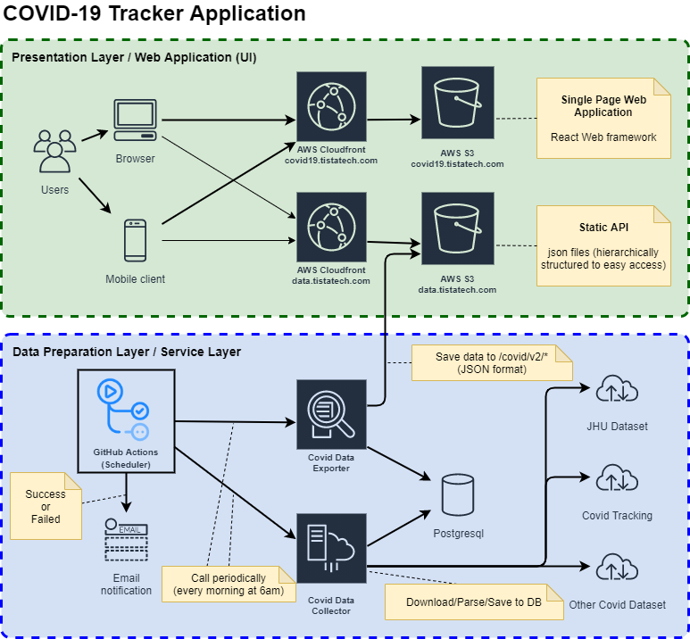

# Tista COVID-19 Tracker

The [repository](https://github.com/TISTATechnologies/cv19) contains all source code for the [Tista COVID-19 Tracker](https://covid19.tistatech.com) Web Application.

* [Data sources](#data-sources)
* [Environment](#environment)
* [Quick Start](#quick-start)
* [Development](#development)
  * [Requirements](#requirements)
  * [Configuration](#configuration)
  * [Release/Deploy](#release)
  * [Collect data](#collect-data)
  * [Export data](#export-data)
* [Testing](#testing)
  * [e2e testing](tests/e2e/README.md)
  * [jmeter](tests/jmeter/README.md)
* [Notes](#notes)
* [Links](#links)
* [License](#license)

## Data sources

The list of the data sources what we are using for the application contains:

* [Johns Hopkins University Center for Systems Science and Engineering](https://github.com/CSSEGISandData/COVID-19)
  * [Countries and US Counties](https://github.com/CSSEGISandData/COVID-19/tree/master/csse_covid_19_data/csse_covid_19_daily_reports)
  * [US States](https://github.com/CSSEGISandData/COVID-19/tree/master/csse_covid_19_data/csse_covid_19_daily_reports_us)
* [The COVID Tracking Project](https://covidtracking.com/)
  * [Covidtracking - API](https://covidtracking.com/data/api)

Other resources
* [CDC Covid Data Tracker](https://covid.cdc.gov/covid-data-tracker)
* [Worldometer](https://www.worldometers.info/coronavirus/)
* [Coronaboard](https://coronaboard.com/)
* [The New York Times US Map and Case Count](https://www.nytimes.com/interactive/2020/us/coronavirus-us-cases.html)

## Environment

* **Postgresql** - stores all collected Covid-19 data (closed for public).
* **AWS S3 Buckets** - hosting a Covid-19 Tracker Web Application and all generated files with data.

### Postgresql Database

Data collector service is using Postgresql database to store all information.

Data exporter service is using Postresql database to transform, analyze, and export Covid-19 data.

### AWS S3 Buckets

#### data.tistatech.com

Data layer for Covid-19 Tracker application.

* [https://data.tistatech.com/common/v1/](https://data.tistatech.com/common/v1/index.html) - all public data (countries, states, counties, population, and etc. information)
* [https://data.tistatech.com/covid/v1/](https://data.tistatech.com/covid/v1/index.html) - Covid-19 related data

#### covid19.tistatech.com

Web application hosting.

* covid19.tistatech.com -> s3://innovation.tistatech.com


### Covid-19 Tracker Application Web servers

All Web server for Covid-19 Tracker Web Application are hosted on AWS S3 buckets.

* **https://covid19.tistatech.com** - Main public server.

## Quick Start

The steps how to setup Tista COVID-19 Tracker Web Application:

1. Get source code from the Github: https://github.com/TISTATechnologies/cv19.
2. Create Postgresql database.
3. Create AWS S3 bucket for data and setup static site hosting on it (ex: cv19data)
4. Create AWS S3 bucket for Web Application and setup static site hosting on it  (ex: cv19web).
5. Create configuration file ~/cv19.dev.conf, use a *.env.sample* file as an example
6. Initialize a new database for *cv19* project: ```CV19_ENV=dev ./data/covid-database/migrate-db.sh init```
7. Collect the data: ```CV19_ENV=dev ./scripts/start-pull-data-services.sh```
8. To see historical and trends data we need to collect more data on each days:
```bash
cd <project dir>
for i in $(seq 90 -1 1); do
    dt=$(date +"%Y-%m-%d" -d "-${i} days")
    yes | ./scripts/start-pull-data-services.sh ${dt} || exit 1
done
```
9. Export collected data to the json files: ```CV19_ENV=dev ./scripts/start-export-data-services.sh```
10. Upload all json files into the AWS S3 bucket with data: ```CV19_ENV=dev ./upload-covid-data-to-s3-bucket.sh```
11. Now you should have latest Covid-19 data on your AWS S3 bucket: http://cv19data.s3-website.us-east-1.amazonaws.com/covid/v1/daily/latest/us/dc/11001.json
12. Build a web application and deploy it to the S3 bucket:
```
export CV19_ENV=dev
cd webapp
npm install
npm run build
npm run deploy
```
13. Now you can open the Tista COVID-19 Tracker site: http://cv19web.s3-website.us-east-1.amazonaws.com

## Development

We are using company [github TISTATechnologies](https://github.com/TISTATechnologies/cv19) to store source code.

Get source code:
```bash
git clone git@github.com:TISTATechnologies/cv19.git
```

### Requirements

1. Nodejs 12+
1. Postgresql Client 10+
1. Python 3.8+
1. awscli

### Architecture



### Code structure
* ```data```                - data and service layer
    - ```covid-database```      - sql script to initialize, update, and work with database
    - ```services```            - services, scripts to collect, transform and export data
* ```scripts```             - devops and helper scripts for the project
* ```tests```               - tests for the project
    - ```data```                - tests to validate data: database and exported static data
    - ```e2e```                 - end-2-end tests for WebApp and for the exported data
    - ```jmeter```              - jmeter tests for loadtesting
* ```webapp```              - source code of a Web Application based on React

### Configuration

Before build and deploy the application, you need to specify configuration 
using system environment variables or specify it inside a ```.env``` file  at the root project's level.

Please look into the ```.env.sample``` for details.

From other side you can create ```~/cv19.xxx.conf``` configuration file inside your home directory 
and specify this configuration file with a system environment variable ```CV19_ENV=xxx```.

*Note*: ```.env``` file has more priority than ~/cv19.xxx.conf file.

### Release

1. Freeze all future changes (new functionality or fixes) should be inside the **develop** branch.
2. The **develop** branch should be at the top of the **master** branch
```bash
git checkout master
git pull
git checkout develop
git rebase master
git push origin develop
```
3. Merge all changes from the **develop** branch into the **master** branch. **Don't make a loops with auto merge.**
```bash
git co master
git merge develop
```
4. Create new tag with the new version
```bash
git tag <new version>                   # example: git tag 1.5.0
git push origin <new version>           # example: git push origin 1.5.0
```
5. Push **master** branch to the remote
```bash
git push origin master
```
6. Now you are ready to deploy a new release version to the Production.

*NOTE*: You must tag the new version release source code in the master branch before the build 
because the WebApp build script is using git tag to generate the _version.json file.

### Build/deploy Web Application manually

See [Configuration](#configuration) section before manual deploy.

```bash
cd <project directory>/webapp
npm install && \
npm run build && \
yes | npm run deploy
```
This script will install all required packages for WebApp, build React application and deploy it to the S3 bucket.

You can specify a configuration file ~/cv19.dev.conf and call this script:
```
export CV19_ENV=dev
cd <project directory>/webapp
npm install && \
npm run build && \
yes | npm run deploy
```

### Create database

```bash
./data/covid-database/migrate-db.sh init
```

### Collect data

* Collect all latest data: ```./scripts/start-pull-data-services.sh```
* Collect data on the specific date: ```./scripts/start-pull-data-services.sh 2020-04-23```

### Export data

* Export all latest data from database: ```./scripts/start-export-data-services.sh```
* Export data on the specific date from database: ```./scripts/start-export-data-services.sh 2020-04-23```

All exported data will be stored inside the ```./build/covid/``` directory.

Use a command ```./scripts/upload-covid-data-to-s3-bucket.sh``` to deploy all data files from ```./build/covid``` to the S3 Bucket.

**NOTE:** Don't forget to remove all data inside the ```./build/``` directory which you are not planning to upload into the S3 Bucket.

## Testing

* [e2e testing](tests/e2e/README.md)
* [jmeter](tests/jmeter/README.md)

## Notes

### Useful/Helper scripts

#### Collect all data for 90 days
```bash
cd <project dir>
for i in $(seq 90 -1 1); do
    dt=$(date +"%Y-%m-%d" -d "-${i} days")
    echo ""
    echo ""
    echo ""
    echo ""
    echo "==================================================================================="
    echo "|  PROCESSING   ${dt}                                                 |"
    echo "==================================================================================="
    yes | ./scripts/start-pull-data-services.sh ${dt} || exit 1
done
```

#### Export all data for 90 days
```bash
for i in $(seq 90 -1 1); do
    dt=$(date +"%Y-%m-%d" -d "-${i} days")
    yes | ./scripts/start-export-data-services.sh ${dt} || exit 1
done
```

#### Collect latest data and upload it to the S3 Bucket

This script can be executed by scheduler every day at 6:00 am to collect and export all new data.
```bash
rm  -rf ./build
yes | ./scripts/start-pull-data-services.sh \
&& yes | ./scripts/start-export-data-services.sh \
&& yes | ./scripts/upload-covid-data-to-s3-bucket.sh
```

#### Test collected and exported data

This script can be executed after the previous script to validate collected data.

```bash
cd tests/e2e
npm install
npm run generate
npm run test:database
npm run test:api
```


## Links

### Data sources: Covid-19
* https://github.com/CSSEGISandData/COVID-19/tree/master/csse_covid_19_data/csse_covid_19_daily_reports
* http://covidtracking.com/api
* https://usafacts.org/visualizations/coronavirus-covid-19-spread-map/
* https://github.com/nytimes/covid-19-data
* https://covid-19.datasettes.com/ -> https://github.com/simonw/covid-19-datasette
* https://coronavirus.jhu.edu/us-map
* https://coronavirus.maryland.gov/


## License

The source code inside this repository are licensed under the [Apache 2.0 License](/LICENSE) and 
the data content is licensed under the [Creative Commons Attribution-ShareAlike 4.0 License](https://creativecommons.org/licenses/by-sa/4.0/).
